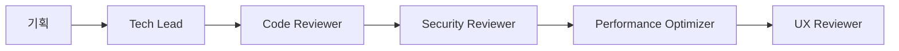
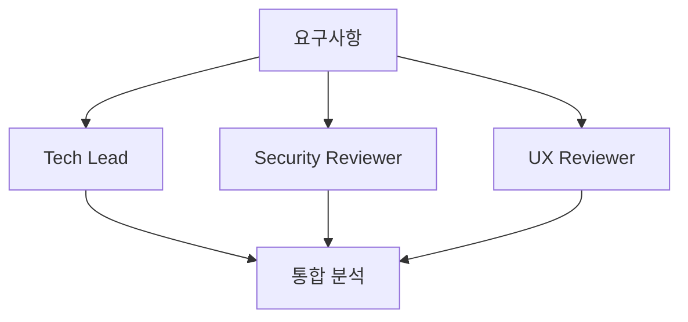
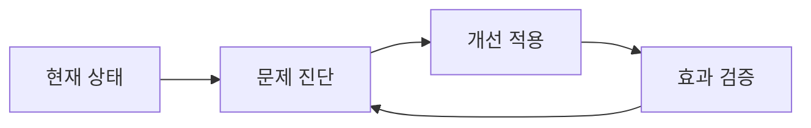

# 🚀 AppMart 전문 Agent 사용 가이드

## 📋 목차
1. [개요](#개요)
2. [설치된 Agent 목록](#설치된-agent-목록)
3. [Agent별 상세 가이드](#agent별-상세-가이드)
4. [사용법 및 활용 시나리오](#사용법-및-활용-시나리오)
5. [협업 워크플로우](#협업-워크플로우)
6. [문제 해결](#문제-해결)
7. [FAQ](#faq)

---

## 개요

AppMart 프로젝트에는 5개의 전문 MCP Agent가 설치되어 있습니다. 각 Agent는 특정 영역의 전문가 역할을 하며, Claude Code를 통해 접근할 수 있습니다.

### 🎯 주요 특징
- **전문화된 분석**: 각 Agent는 특정 영역에 최적화
- **협업 지원**: Agent 간 연계 분석 가능
- **실시간 피드백**: 즉시 분석 결과 제공
- **통합 리포트**: 종합적인 개선 방안 제시

---

## 설치된 Agent 목록

| Agent | 역할 | 주요 기능 | 상태 |
|-------|------|-----------|------|
| 🔍 **Code Reviewer** | 코드 품질 전문가 | 코드 리뷰, 리팩토링, 최적화 | ✅ 활성 |
| 🔐 **Security Reviewer** | 보안 전문가 | 취약점 분석, 보안 강화 | ✅ 활성 |
| 🏗️ **Tech Lead** | 기술 리더 | 아키텍처 설계, 기술 선택 | ✅ 활성 |
| 🎨 **UX Reviewer** | UX/UI 전문가 | 사용자 경험, 접근성 | ✅ 활성 |
| ⚡ **Performance Optimizer** | 성능 전문가 | 성능 최적화, 모니터링 | ✅ 활성 |

---

## Agent별 상세 가이드

### 🔍 Code Reviewer Agent

**역할**: 코드 품질 검토 및 개선 방안 제시

#### 주요 기능
- `review_code`: 코드 품질 종합 검토
- `analyze_structure`: 코드 구조 분석
- `suggest_improvements`: 개선 방안 제시

#### 사용 예시
```javascript
// 검토할 코드
function calculateTotal(items) {
    var total = 0;
    for (var i = 0; i < items.length; i++) {
        if (items[i].price) {
            total = total + items[i].price * items[i].quantity;
        }
    }
    return total;
}
```

#### 예상 분석 결과
- ❌ var 대신 let/const 사용 권장
- ❌ 구형 for문 → forEach/reduce 사용
- ❌ 에러 처리 부족
- ✅ 개선된 코드 예시 제공

---

### 🔐 Security Reviewer Agent

**역할**: 보안 취약점 분석 및 데이터 보호 강화

#### 주요 기능
- `security_audit`: 전반적인 보안 감사
- `vulnerability_scan`: 특정 취약점 스캔
- `env_security_check`: 환경 변수 보안 검사
- `generate_security_checklist`: 보안 체크리스트 생성

#### 위험도 분류
- 🔴 **높음**: 즉시 수정 필요 (데이터 유출 위험)
- 🟡 **중간**: 빠른 수정 권장 (잠재적 위험)
- 🟢 **낮음**: 보안 강화 개선 사항

#### 주요 검사 항목
- SQL 인젝션 취약점
- XSS (Cross-Site Scripting) 방지
- 하드코딩된 시크릿 탐지
- 환경 변수 보안 검증

---

### 🏗️ Tech Lead Agent

**역할**: 시스템 아키텍처 설계 및 기술적 의사결정

#### 주요 기능
- `architecture_design`: 시스템 아키텍처 설계
- `tech_stack_recommendation`: 기술 스택 추천
- `scalability_analysis`: 확장성 분석
- `implementation_roadmap`: 구현 로드맵 생성
- `code_architecture_review`: 코드 아키텍처 검토

#### 의사결정 기준
- **확장성**: 미래 성장 고려
- **유지보수성**: 장기적 관리 용이성
- **성능**: 응답 시간 최적화
- **비용 효율성**: 개발/운영 비용
- **개발 생산성**: 팀 개발 속도

---

### 🎨 UX Reviewer Agent

**역할**: 사용자 경험 최적화 및 접근성 향상

#### 주요 기능
- `analyze_user_experience`: 사용자 경험 분석
- `accessibility_audit`: 웹 접근성 감사
- `user_journey_analysis`: 사용자 여정 분석
- `ui_design_review`: UI 디자인 검토
- `mobile_ux_optimization`: 모바일 UX 최적화
- `generate_ux_test_plan`: UX 테스트 계획 생성

#### 분석 기준
- **학습 용이성**: 처음 사용자도 쉽게 이해
- **효율성**: 빠르고 정확한 작업 완료
- **접근성**: WCAG 2.1 AA 준수
- **만족도**: 긍정적인 사용자 경험

---

### ⚡ Performance Optimizer Agent

**역할**: 애플리케이션 성능 분석 및 최적화

#### 주요 기능
- `analyze_web_performance`: 웹 성능 분석
- `optimize_frontend_code`: 프론트엔드 최적화
- `optimize_database_queries`: DB 쿼리 최적화
- `analyze_bundle_size`: 번들 크기 분석
- `create_caching_strategy`: 캐싱 전략 수립
- `generate_performance_monitoring_plan`: 성능 모니터링 계획

#### Core Web Vitals 목표
- **LCP**: 2.5초 이하
- **FID**: 100ms 이하
- **CLS**: 0.1 이하

---

## 사용법 및 활용 시나리오

### 🎯 기본 사용법

1. **Claude Code 실행**
2. **Agent 호출**: 각 Agent의 기능을 직접 사용
3. **결과 분석**: 제공된 분석 결과 검토
4. **개선 적용**: 권장사항 적용

### 📝 활용 시나리오

#### 시나리오 1: 새로운 기능 개발
```
1. Tech Lead → 아키텍처 설계
2. Code Reviewer → 코드 품질 검토
3. Security Reviewer → 보안 취약점 검사
4. Performance Optimizer → 성능 최적화
5. UX Reviewer → 사용자 경험 검증
```

#### 시나리오 2: 기존 시스템 개선
```
1. Performance Optimizer → 성능 병목 분석
2. Security Reviewer → 보안 감사
3. UX Reviewer → 사용성 문제 진단
4. Code Reviewer → 리팩토링 방안 제시
5. Tech Lead → 전체적인 개선 계획 수립
```

#### 시나리오 3: 출시 전 점검
```
1. Security Reviewer → 최종 보안 검사
2. Performance Optimizer → 성능 최적화 확인
3. UX Reviewer → 접근성 및 사용성 검증
4. Code Reviewer → 코드 품질 최종 검토
5. Tech Lead → 출시 준비 상태 평가
```

---

## 협업 워크플로우

### 🔄 Agent 간 협업 패턴

#### 패턴 1: 순차적 협업


#### 패턴 2: 병렬 분석


#### 패턴 3: 반복적 개선


### 📊 통합 리포트 활용

모든 Agent의 분석 결과를 종합하여 다음과 같은 통합 리포트를 생성할 수 있습니다:

1. **종합 점수**: 각 영역별 점수 및 개선 효과
2. **우선순위**: 긴급도에 따른 작업 순서
3. **리소스 배치**: 필요한 인력 및 시간
4. **ROI 분석**: 투자 대비 효과 예측

---

## 문제 해결

### 🔧 일반적인 문제

#### Q: Agent가 응답하지 않아요
**A**: 다음을 확인해주세요:
1. Claude Code 재시작
2. 설정 파일 확인 (`settings.local.json`)
3. Node.js 및 MCP SDK 설치 상태
4. Agent 파일 경로 확인

#### Q: 분석 결과가 부정확해요
**A**: 다음을 시도해보세요:
1. 더 구체적인 정보 제공
2. 코드/데이터의 완전성 확인
3. 컨텍스트 정보 추가 제공

#### Q: Agent 간 결과가 상충해요
**A**: 정상적인 현상입니다:
1. 각 Agent는 서로 다른 관점에서 분석
2. 우선순위를 고려하여 균형잡힌 결정
3. Tech Lead Agent의 종합 판단 활용

### 🛠️ 기술적 문제

#### MCP 연결 오류
```bash
# 연결 상태 확인
node test-agent-connections.js

# 의존성 재설치
npm install @modelcontextprotocol/sdk
```

#### Agent 파일 권한 문제
```bash
# 실행 권한 부여 (Linux/Mac)
chmod +x *-agent.js

# Windows에서는 관리자 권한으로 실행
```

---

## FAQ

### 💡 자주 묻는 질문

**Q: Agent를 동시에 여러 개 사용할 수 있나요?**
A: 네, 각 Agent는 독립적으로 동작하며 동시 사용이 가능합니다.

**Q: 커스텀 Agent를 추가할 수 있나요?**
A: 네, MCP 표준을 따라 새로운 Agent를 개발하여 추가할 수 있습니다.

**Q: Agent 분석 결과를 저장할 수 있나요?**
A: Claude Code의 대화 기록에 자동 저장되며, 필요시 별도 파일로 내보낼 수 있습니다.

**Q: 어떤 Agent를 먼저 사용해야 하나요?**
A: 프로젝트 상황에 따라 다르지만, 일반적으로 Tech Lead → Security → Code Reviewer 순서를 권장합니다.

**Q: Agent 분석에 소요되는 시간은?**
A: 코드 복잡도에 따라 몇 초에서 몇 분까지 소요될 수 있습니다.

---

## 📞 지원 및 피드백

### 문의 채널
- **기술 지원**: AppMart 개발팀
- **버그 리포트**: GitHub Issues
- **기능 요청**: 팀 Slack 채널

### 업데이트 정보
- Agent 기능 업데이트는 정기적으로 제공됩니다
- 새로운 Agent 추가 시 별도 안내됩니다
- 성능 개선 및 버그 수정은 지속적으로 진행됩니다

---

*마지막 업데이트: 2025년 8월 4일*
*버전: 1.0.0*