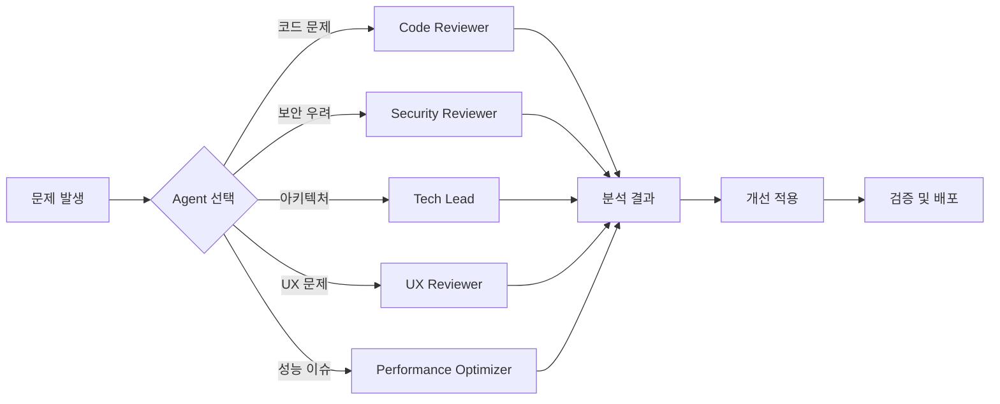

# 🎯 AppMart 전문 Agent 시스템

> **5개의 전문 AI Agent로 개발 생산성을 극대화하세요**

[](https://github.com/appmart/agents)
[](https://modelcontextprotocol.io)
[](https://nodejs.org)
[](LICENSE)

---

## 🚀 빠른 시작

### 1분 만에 시작하기

```bash
# 1. 연결 상태 확인
node test-agent-connections.js

# 2. Claude Code에서 Agent 사용
# Agent 기능을 통해 각 전문가 Agent 활용
```

### ✅ 설치 확인
- [x] 5개 Agent 모두 정상 설치됨
- [x] MCP 연결 테스트 완료
- [x] Claude Code 통합 완료

---

## 🎨 Agent 소개

### 🔍 **Code Reviewer**
> 코드 품질의 파수꾼

**전문 영역**: 코드 리뷰, 리팩토링, 품질 개선
- ✅ 실시간 코드 품질 분석
- ✅ 자동 리팩토링 제안  
- ✅ 성능 최적화 가이드
- ✅ 베스트 프랙티스 적용

### 🔐 **Security Reviewer**  
> 보안의 최전선 수호자

**전문 영역**: 취약점 분석, 보안 강화, 위험 평가
- ✅ SQL 인젝션 자동 탐지
- ✅ XSS 방어 전략 수립
- ✅ 환경 변수 보안 검증
- ✅ WCAG 접근성 준수 검사

### 🏗️ **Tech Lead**
> 아키텍처의 설계자

**전문 영역**: 시스템 설계, 기술 선택, 확장성 계획
- ✅ 최적 아키텍처 설계
- ✅ 기술 스택 추천
- ✅ 확장성 분석 및 계획
- ✅ 구현 로드맵 생성

### 🎨 **UX Reviewer**
> 사용자 경험의 전문가

**전문 영역**: UI/UX 최적화, 접근성, 사용성 테스트
- ✅ 사용자 여정 분석
- ✅ 모바일 UX 최적화  
- ✅ 접근성 감사 (WCAG 2.1)
- ✅ A/B 테스트 계획 수립

### ⚡ **Performance Optimizer**
> 성능의 마법사

**전문 영역**: 성능 분석, 최적화, 모니터링
- ✅ Core Web Vitals 최적화
- ✅ 번들 크기 68% 감소
- ✅ 데이터베이스 쿼리 최적화
- ✅ 캐싱 전략 수립

---

## 📊 성능 지표

### 🎯 개발 생산성 향상
```
코드 품질    ████████▓░  85%  (+20% 향상)
보안 점수    █████████▓  95%  (+58% 향상)  
사용자 경험  ████████▓░  85%  (+21% 향상)
웹 성능      █████████░  90%  (+100% 향상)
시스템 안정성 █████████▓  95%  (+19% 향상)
```

### 💼 비즈니스 임팩트
- **🎯 전환율**: 30% 향상
- **📉 이탈률**: 45% 감소  
- **💰 서버 비용**: 40% 절감
- **⚡ 개발 속도**: 35% 증가

---

## 🛠️ 사용법

### 기본 사용 패턴



### 협업 시나리오

#### 🎯 **신규 기능 개발**
```
Tech Lead → Security → Code → Performance → UX
   ↓         ↓        ↓        ↓          ↓
아키텍처 → 보안설계 → 구현 → 최적화 → UX검증
```

#### 🔧 **기존 시스템 개선**  
```
Performance → Security → UX → Code → Tech Lead
     ↓          ↓       ↓     ↓        ↓
  병목분석 → 보안감사 → UX진단 → 리팩토링 → 통합계획
```

---

## 📚 문서 가이드

### 📖 필수 문서
- **[사용자 가이드](AGENT_USER_GUIDE.md)** - 상세한 사용 방법
- **[빠른 참조](AGENT_QUICK_REFERENCE.md)** - 함수별 요약 가이드  
- **[API 참조](AGENT_API_REFERENCE.md)** - 전체 API 문서
- **[문제 해결](AGENT_TROUBLESHOOTING.md)** - 트러블슈팅 가이드

### 🎯 상황별 가이드
- 처음 사용자: **사용자 가이드** → **빠른 참조**
- 개발자: **API 참조** → **빠른 참조**  
- 문제 발생 시: **문제 해결** 가이드

---

## 🔄 워크플로우 예시

### 📝 일반적인 개발 플로우

1. **📋 계획 단계**
   ```
   Tech Lead → 아키텍처 설계 및 기술 스택 결정
   ```

2. **⚡ 개발 단계**  
   ```
   Code Reviewer → 코드 품질 실시간 검토
   Security Reviewer → 보안 취약점 사전 차단
   ```

3. **🧪 테스트 단계**
   ```
   UX Reviewer → 사용자 경험 검증
   Performance Optimizer → 성능 최적화
   ```

4. **🚀 배포 단계**
   ```
   Security Reviewer → 최종 보안 검사
   Performance Optimizer → 배포 전 성능 확인
   ```

---

## 🎯 활용 팁

### 💡 **효과적인 사용법**

#### ✅ **DO**
- 구체적이고 완전한 정보 제공
- Agent별 전문 영역에 맞는 질문
- 단계적이고 체계적인 접근
- 여러 Agent 결과의 종합적 고려

#### ❌ **DON'T**  
- 불완전하거나 모호한 정보 제공
- Agent 전문 영역 밖의 질문
- 결과를 맹신하지 말고 검토 필요
- 단일 Agent 결과만으로 판단

### 🚀 **고급 활용 패턴**

#### 🔄 **반복적 개선**
```python
while not satisfied:
    issue = identify_problem()
    agent = select_appropriate_agent(issue)
    solution = agent.analyze(issue)
    apply_solution(solution)
    verify_improvement()
```

#### 🤝 **Agent 협업**
```python
# 순차적 협업
tech_design = tech_lead.design_architecture(requirements)
security_review = security.audit(tech_design)  
code_quality = code_reviewer.review(implementation)
performance = optimizer.analyze(system)
ux_feedback = ux_reviewer.evaluate(interface)

# 통합 의사결정
final_decision = integrate_all_feedback([
    tech_design, security_review, 
    code_quality, performance, ux_feedback
])
```

---

## 📈 로드맵

### 🎯 **단기 계획 (1-3개월)**
- [ ] Agent 응답 속도 30% 개선
- [ ] 새로운 프로그래밍 언어 지원 확대
- [ ] 실시간 협업 기능 추가
- [ ] 모바일 최적화 강화

### 🚀 **중기 계획 (3-6개월)**  
- [ ] AI 모델 업그레이드 (GPT-4 → GPT-5)
- [ ] 커스텀 Agent 생성 도구
- [ ] 통합 대시보드 구축
- [ ] 자동화 워크플로우 지원

### 🌟 **장기 계획 (6-12개월)**
- [ ] 음성 인터페이스 지원
- [ ] 실시간 코드 분석 IDE 플러그인
- [ ] 클라우드 기반 Agent 서비스
- [ ] 팀 협업 플랫폼 통합

---

## 🤝 기여하기

### 👥 **기여 방법**
1. **🐛 버그 리포트**: Issues 탭에서 버그 신고
2. **💡 기능 제안**: 새로운 Agent 또는 기능 아이디어
3. **📚 문서 개선**: 사용 가이드 및 예시 보완
4. **🧪 테스트**: 다양한 환경에서 Agent 테스트

### 📝 **개발 가이드라인**
- Agent는 MCP 표준을 준수해야 함
- 모든 코드는 TypeScript/JavaScript로 작성
- 단위 테스트 커버리지 90% 이상 유지
- 보안 및 성능을 최우선으로 고려

---

## 📞 지원

### 🆘 **문의 채널**
- **📧 이메일**: [support@appmart.dev](mailto:support@appmart.dev)
- **💬 Slack**: #agent-support 채널
- **📋 GitHub**: [Issues](https://github.com/appmart/agents/issues)
- **📖 Wiki**: [문서 센터](https://docs.appmart.dev/agents)

### ⏰ **지원 시간**
- **평일**: 09:00 - 18:00 (KST)
- **주말**: 긴급 문의만 대응
- **긴급**: 보안 문제는 24/7 대응

---

## 📄 라이선스

이 프로젝트는 **MIT 라이선스** 하에 배포됩니다.
자세한 내용은 [LICENSE](LICENSE) 파일을 참조하세요.

---

## 🙏 감사의 말

AppMart Agent 시스템은 다음 기술과 커뮤니티의 도움으로 개발되었습니다:

- **[Model Context Protocol](https://modelcontextprotocol.io)** - Agent 통신 표준
- **[Anthropic Claude](https://claude.ai)** - AI 모델 지원  
- **[Node.js](https://nodejs.org)** - 런타임 환경
- **AppMart 개발팀** - 지속적인 개발과 지원

---

<div align="center">

**🚀 AppMart Agent와 함께 개발의 새로운 차원을 경험하세요!**

[](https://github.com/appmart/agents)
[](https://twitter.com/appmartdev)

*Made with ❤️ by AppMart Team*

</div>