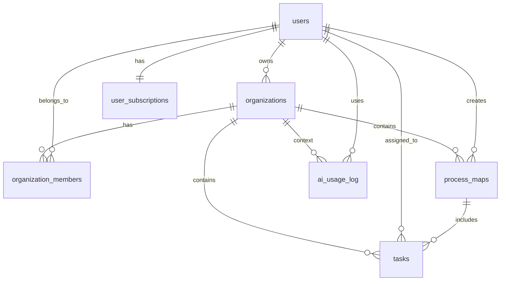

# BPR Hub Database Schema Documentation

> **Business Process Reengineering Management System**  
> Version: 1.0  
> Created: 2025-01-26  
> Database: MySQL 8.0+

## 📋 목차

1. [개요](#개요)
2. [데이터베이스 구조](#데이터베이스-구조)
3. [테이블 상세](#테이블-상세)
4. [관계도](#관계도)
5. [인덱스 전략](#인덱스-전략)
6. [뷰 및 트리거](#뷰-및-트리거)
7. [설치 및 사용법](#설치-및-사용법)

---

## 🎯 개요

BPR Hub는 비즈니스 프로세스 재설계(Business Process Reengineering)를 지원하는 웹 애플리케이션입니다. 이 데이터베이스는 다음과 같은 핵심 기능을 지원합니다:

### 🚀 핵심 기능
- **사용자 관리**: 이메일 및 소셜 로그인 (카카오, 구글)
- **조직 관리**: 다중 조직 지원 및 멤버 관리
- **프로세스 맵**: 비즈니스 프로세스 시각화 및 관리
- **작업 관리**: DB, CM, DM 유형별 작업 추적
- **구독 관리**: 무료/프리미엄/엔터프라이즈 플랜
- **AI 통합**: OpenAI 기반 프로세스 분석 및 최적화

### 🛠 기술 스택
- **데이터베이스**: MySQL 8.0+
- **문자셋**: UTF8MB4 (이모지 지원)
- **스토리지 엔진**: InnoDB
- **외래키**: FOREIGN KEY 제약조건 활용

---

## 📊 데이터베이스 구조

### 테이블 목록

| 테이블명 | 용도 | 주요 관계 |
|---------|------|----------|
| `users` | 사용자 정보 | 모든 테이블의 기준점 |
| `organizations` | 조직 정보 | users(소유자) |
| `organization_members` | 조직 구성원 | users ↔ organizations |
| `user_subscriptions` | 구독 정보 | users |
| `process_maps` | 프로세스 맵 | users, organizations |
| `tasks` | 작업 관리 | users, organizations, process_maps |
| `ai_usage_log` | AI 사용 로그 | users, organizations |

### 데이터 흐름

```
사용자 가입 → 무료 구독 자동 생성
         ↓
조직 생성 → 소유자 자동 멤버 등록
         ↓
프로세스 맵 생성 → 작업 등록
         ↓
AI 분석 요청 → 사용량 로그 기록
```

---

## 📋 테이블 상세

### 👤 users - 사용자 테이블

**목적**: 시스템의 모든 사용자 정보를 저장

| 컬럼명 | 타입 | 설명 | 제약조건 |
|--------|------|------|----------|
| `id` | INT | 사용자 고유 ID | PRIMARY KEY, AUTO_INCREMENT |
| `email` | VARCHAR(255) | 이메일 주소 | UNIQUE, NOT NULL |
| `password_hash` | VARCHAR(255) | 암호화된 비밀번호 | NOT NULL |
| `first_name` | VARCHAR(100) | 이름 | NOT NULL |
| `last_name` | VARCHAR(100) | 성 | NOT NULL |
| `full_name` | VARCHAR(200) | 전체 이름 | GENERATED (계산 컬럼) |
| `phone` | VARCHAR(20) | 전화번호 | |
| `profile_image` | VARCHAR(500) | 프로필 이미지 URL | |
| `login_type` | ENUM | 로그인 유형 | 'email', 'kakao', 'google' |
| `social_id` | VARCHAR(255) | 소셜 로그인 ID | |
| `email_verified` | BOOLEAN | 이메일 인증 여부 | DEFAULT FALSE |
| `is_active` | BOOLEAN | 계정 활성화 상태 | DEFAULT TRUE |
| `last_login_at` | TIMESTAMP | 마지막 로그인 시간 | |
| `created_at` | TIMESTAMP | 생성 시간 | DEFAULT CURRENT_TIMESTAMP |
| `updated_at` | TIMESTAMP | 수정 시간 | ON UPDATE CURRENT_TIMESTAMP |

**특징**:
- 소셜 로그인 지원 (카카오, 구글)
- 비밀번호 해시 저장 (bcrypt 권장)
- 생성된 컬럼으로 전체 이름 자동 생성

### 🏢 organizations - 조직 테이블

**목적**: 회사, 팀, 프로젝트 등의 조직 정보 관리

| 컬럼명 | 타입 | 설명 | 제약조건 |
|--------|------|------|----------|
| `id` | INT | 조직 고유 ID | PRIMARY KEY, AUTO_INCREMENT |
| `name` | VARCHAR(200) | 조직명 | NOT NULL |
| `slug` | VARCHAR(100) | URL 친화적 식별자 | UNIQUE, NOT NULL |
| `description` | TEXT | 조직 설명 | |
| `logo_url` | VARCHAR(500) | 로고 이미지 URL | |
| `website` | VARCHAR(255) | 웹사이트 URL | |
| `timezone` | VARCHAR(50) | 시간대 | DEFAULT 'Asia/Seoul' |
| `language` | VARCHAR(10) | 언어 설정 | DEFAULT 'ko' |
| `max_members` | INT | 최대 멤버 수 | DEFAULT 50 |
| `owner_id` | INT | 소유자 ID | FOREIGN KEY → users(id) |
| `is_active` | BOOLEAN | 활성화 상태 | DEFAULT TRUE |

**특징**:
- 슬러그를 통한 SEO 친화적 URL 지원
- 멤버 수 제한 관리
- 다국어 및 시간대 설정

### 👥 organization_members - 조직 구성원 테이블

**목적**: 사용자와 조직 간의 다대다 관계 및 역할 관리

| 컬럼명 | 타입 | 설명 | 제약조건 |
|--------|------|------|----------|
| `id` | INT | 구성원 관계 ID | PRIMARY KEY, AUTO_INCREMENT |
| `organization_id` | INT | 조직 ID | FOREIGN KEY → organizations(id) |
| `user_id` | INT | 사용자 ID | FOREIGN KEY → users(id) |
| `role` | ENUM | 역할 | 'owner', 'admin', 'manager', 'member' |
| `title` | VARCHAR(100) | 직책 | |
| `department` | VARCHAR(100) | 부서 | |
| `status` | ENUM | 상태 | 'active', 'inactive', 'pending' |
| `invited_by` | INT | 초대자 ID | FOREIGN KEY → users(id) |
| `joined_at` | TIMESTAMP | 가입 일시 | |

**특징**:
- 계층적 권한 관리 (owner > admin > manager > member)
- 초대 시스템 지원
- 부서 및 직책 정보 관리

### 💳 user_subscriptions - 구독 테이블

**목적**: 사용자별 구독 플랜 및 사용량 관리

| 컬럼명 | 타입 | 설명 | 제약조건 |
|--------|------|------|----------|
| `id` | INT | 구독 ID | PRIMARY KEY, AUTO_INCREMENT |
| `user_id` | INT | 사용자 ID | FOREIGN KEY → users(id) |
| `plan_type` | ENUM | 플랜 유형 | 'free', 'premium', 'enterprise' |
| `plan_name` | VARCHAR(100) | 플랜명 | NOT NULL |
| `status` | ENUM | 구독 상태 | 'active', 'inactive', 'expired', 'cancelled' |
| `started_at` | TIMESTAMP | 구독 시작일 | DEFAULT CURRENT_TIMESTAMP |
| `expires_at` | TIMESTAMP | 만료일 | |
| `max_process_maps` | INT | 프로세스 맵 한도 | DEFAULT 5 |
| `max_organization_members` | INT | 조직 멤버 한도 | DEFAULT 10 |
| `ai_tokens_limit` | INT | AI 토큰 한도 | DEFAULT 0 |
| `ai_tokens_used` | INT | 사용된 AI 토큰 | DEFAULT 0 |
| `amount` | DECIMAL(10,2) | 결제 금액 | |
| `currency` | VARCHAR(3) | 통화 | DEFAULT 'KRW' |

**특징**:
- 플랜별 사용량 제한 관리
- AI 토큰 사용량 추적
- 결제 정보 연동 지원

### 🗺 process_maps - 프로세스 맵 테이블

**목적**: 비즈니스 프로세스 시각화 데이터 저장

| 컬럼명 | 타입 | 설명 | 제약조건 |
|--------|------|------|----------|
| `id` | INT | 프로세스 맵 ID | PRIMARY KEY, AUTO_INCREMENT |
| `title` | VARCHAR(200) | 제목 | NOT NULL |
| `description` | TEXT | 설명 | |
| `organization_id` | INT | 소속 조직 ID | FOREIGN KEY → organizations(id) |
| `created_by` | INT | 생성자 ID | FOREIGN KEY → users(id) |
| `map_data` | JSON | 프로세스 맵 데이터 | |
| `thumbnail_url` | VARCHAR(500) | 썸네일 이미지 URL | |
| `version` | INT | 버전 | DEFAULT 1 |
| `is_template` | BOOLEAN | 템플릿 여부 | DEFAULT FALSE |
| `template_category` | VARCHAR(100) | 템플릿 카테고리 | |
| `visibility` | ENUM | 공개 범위 | 'private', 'organization', 'public' |
| `status` | ENUM | 상태 | 'draft', 'active', 'archived' |
| `view_count` | INT | 조회수 | DEFAULT 0 |

**특징**:
- JSON 형태로 프로세스 맵 데이터 저장
- 버전 관리 지원
- 템플릿 시스템 지원
- 공개 범위 설정

### ✅ tasks - 작업 테이블

**목적**: 프로세스 내 개별 작업 관리 및 추적

| 컬럼명 | 타입 | 설명 | 제약조건 |
|--------|------|------|----------|
| `id` | INT | 작업 ID | PRIMARY KEY, AUTO_INCREMENT |
| `title` | VARCHAR(200) | 작업 제목 | NOT NULL |
| `description` | TEXT | 작업 설명 | |
| `organization_id` | INT | 소속 조직 ID | FOREIGN KEY → organizations(id) |
| `process_map_id` | INT | 소속 프로세스 맵 ID | FOREIGN KEY → process_maps(id) |
| `task_type` | ENUM | 작업 유형 | 'DB', 'CM', 'DM', 'OTHER' |
| `category` | VARCHAR(100) | 카테고리 | |
| `processing_time` | INT | 처리 시간 (분) | DEFAULT 0 |
| `lead_time` | INT | 리드 타임 (분) | DEFAULT 0 |
| `assigned_to` | INT | 담당자 ID | FOREIGN KEY → users(id) |
| `assigned_by` | INT | 배정자 ID | FOREIGN KEY → users(id) |
| `status` | ENUM | 상태 | 'todo', 'in_progress', 'review', 'completed', 'cancelled' |
| `priority` | ENUM | 우선순위 | 'low', 'medium', 'high', 'urgent' |
| `progress_percentage` | INT | 진행률 (%) | DEFAULT 0 |
| `due_date` | DATE | 마감일 | |
| `ai_analysis` | JSON | AI 분석 결과 | |
| `ai_suggestions` | TEXT | AI 제안사항 | |
| `optimization_score` | INT | 최적화 점수 | DEFAULT 0 |
| `tags` | JSON | 태그 목록 | |

**특징**:
- BPR 표준 작업 유형 (DB: Database, CM: Communication, DM: Decision Making)
- 처리 시간 및 리드 타임 추적
- AI 분석 결과 저장
- 진행률 및 우선순위 관리

### 🤖 ai_usage_log - AI 사용 로그 테이블

**목적**: AI 기능 사용량 추적 및 과금 관리

| 컬럼명 | 타입 | 설명 | 제약조건 |
|--------|------|------|----------|
| `id` | INT | 로그 ID | PRIMARY KEY, AUTO_INCREMENT |
| `user_id` | INT | 사용자 ID | FOREIGN KEY → users(id) |
| `organization_id` | INT | 조직 ID | FOREIGN KEY → organizations(id) |
| `feature_type` | VARCHAR(50) | AI 기능 유형 | NOT NULL |
| `request_data` | JSON | 요청 데이터 | |
| `response_data` | JSON | 응답 데이터 | |
| `tokens_used` | INT | 사용된 토큰 수 | DEFAULT 0 |
| `cost` | DECIMAL(10,4) | 비용 | DEFAULT 0.0000 |
| `status` | ENUM | 처리 상태 | 'success', 'error', 'timeout' |
| `error_message` | TEXT | 오류 메시지 | |

**특징**:
- OpenAI API 토큰 사용량 추적
- 기능별 사용 통계 수집
- 비용 계산 및 과금 데이터

---

## 🔗 관계도



### 🔑 주요 관계

1. **사용자 ↔ 조직**: 다대다 관계 (organization_members를 통해 연결)
2. **조직 ↔ 프로세스 맵**: 일대다 관계
3. **프로세스 맵 ↔ 작업**: 일대다 관계
4. **사용자 ↔ 구독**: 일대일 관계 (현재 활성 구독 기준)

---

## 📈 인덱스 전략

### 기본 인덱스

```sql
-- 사용자 관련
INDEX idx_email ON users(email)
INDEX idx_social ON users(login_type, social_id)

-- 조직 관련  
INDEX idx_slug ON organizations(slug)
INDEX idx_org_user_role ON organization_members(user_id, organization_id, role)

-- 프로세스 맵 관련
INDEX idx_org_process_status ON process_maps(organization_id, status, created_at)

-- 작업 관련
INDEX idx_task_assigned_status ON tasks(assigned_to, status, due_date)
INDEX idx_task_type ON tasks(task_type)

-- AI 사용 로그
INDEX idx_ai_usage_date ON ai_usage_log(user_id, created_at, feature_type)
```

### 성능 최적화 팁

1. **복합 인덱스**: 자주 함께 조회되는 컬럼들에 복합 인덱스 적용
2. **JSON 컬럼**: MySQL 8.0의 JSON 검색 기능 활용
3. **파티셔닝**: 대용량 로그 테이블은 날짜별 파티셔닝 고려

---

## ⚙️ 뷰 및 트리거

### 📊 주요 뷰

#### v_organization_summary
조직별 요약 정보를 제공하는 뷰

```sql
CREATE VIEW v_organization_summary AS
SELECT 
    o.id, o.name, o.slug, o.owner_id,
    COUNT(om.id) as member_count,
    o.max_members, o.created_at
FROM organizations o
LEFT JOIN organization_members om 
    ON o.id = om.organization_id AND om.status = 'active'
GROUP BY o.id;
```

#### v_user_subscription_info
사용자별 구독 정보를 제공하는 뷰

```sql
CREATE VIEW v_user_subscription_info AS
SELECT 
    u.id as user_id, u.email, u.full_name,
    us.plan_type, us.status as subscription_status,
    us.max_process_maps, us.ai_tokens_limit, 
    us.ai_tokens_used, us.expires_at
FROM users u
LEFT JOIN user_subscriptions us 
    ON u.id = us.user_id AND us.status = 'active';
```

### ⚡ 자동화 트리거

#### 조직 소유자 자동 등록
```sql
CREATE TRIGGER tr_organization_add_owner 
AFTER INSERT ON organizations
FOR EACH ROW
BEGIN
    INSERT INTO organization_members (organization_id, user_id, role, status, joined_at)
    VALUES (NEW.id, NEW.owner_id, 'owner', 'active', NOW());
END;
```

#### 무료 구독 자동 생성
```sql
CREATE TRIGGER tr_user_create_subscription 
AFTER INSERT ON users
FOR EACH ROW
BEGIN
    INSERT INTO user_subscriptions (user_id, plan_type, plan_name, status)
    VALUES (NEW.id, 'free', 'Free Plan', 'active');
END;
```

---

## 🚀 설치 및 사용법

### 1. 데이터베이스 생성

```bash
# MySQL 접속
mysql -u root -p

# 스크립트 실행
source /path/to/create_tables.sql
```

### 2. 샘플 데이터 삽입

```bash
# 샘플 데이터 삽입
source /path/to/insert_sample_data.sql
```

### 3. 데이터 확인

```sql
-- 테이블 생성 확인
SHOW TABLES;

-- 샘플 데이터 확인
SELECT * FROM v_organization_summary;
SELECT * FROM v_user_subscription_info LIMIT 5;
```

### 4. 환경별 설정

#### 개발 환경
```php
// config/database.php
$config = [
    'host' => 'localhost',
    'database' => 'bpr_hub',
    'username' => 'root', 
    'password' => '',
    'charset' => 'utf8mb4'
];
```

#### 운영 환경 (dothome.co.kr)
```php
// config/production.php
$config = [
    'host' => 'localhost',
    'database' => 'your_db_name',
    'username' => 'your_username',
    'password' => 'your_password',
    'charset' => 'utf8mb4'
];
```

---

## 📚 참고 자료

### BPR 용어 설명

- **DB (Database)**: 데이터 입력, 조회, 수정 관련 작업
- **CM (Communication)**: 의사소통, 승인, 검토 관련 작업  
- **DM (Decision Making)**: 의사결정, 판단 관련 작업
- **PT (Processing Time)**: 실제 작업 처리 시간
- **LT (Lead Time)**: 요청부터 완료까지 총 소요 시간

### 데이터 타입 선택 기준

- **VARCHAR vs TEXT**: 255자 이하는 VARCHAR, 이상은 TEXT
- **INT vs BIGINT**: 일반적으로 INT 사용, 대용량 데이터는 BIGINT
- **TIMESTAMP vs DATETIME**: 시간대 변환이 필요한 경우 TIMESTAMP
- **JSON**: 구조화되지 않은 데이터나 동적 필드에 사용

### 보안 고려사항

1. **비밀번호**: bcrypt로 해시 처리 (cost factor 10-12)
2. **SQL 인젝션**: Prepared Statement 사용
3. **권한 관리**: 최소 권한 원칙 적용
4. **개인정보**: GDPR, 개인정보보호법 준수

---

> **📝 Version History**  
> v1.0 (2025-01-26): 초기 데이터베이스 스키마 설계 완료